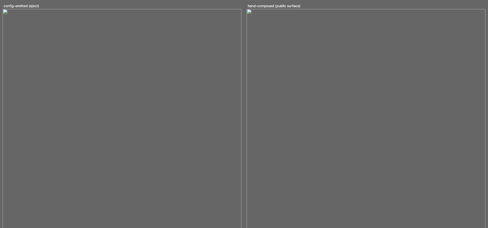

# Composition spike: the support widget, hand-authored vs config-emitted

**Date:** 2026-08-31 · **Requested by:** owner, after T-5 Amendment 3 ruled "split at the thread" (tier 1, incl. the support widget, stays config-tier). The owner is drawn to composition even for tier 1 because composed source is what a coding agent can customize later. This spike tests that on config's strongest case.

**Method:** ejected the `widget.construct.json` fixture through the construct CLI (version A), then hand-authored the same widget from the documented public surface only: kai-* elements, JS properties, kai-* events, `@kitn.ai/ui/state` + `/wire`, against the packed local tarball (version B). Both driven through the same Playwright story, light and dark. Sources and screenshots sit beside this file (`config-widget-src/`, `composed-widget-src/`, `shots/`).

**Caveat on the kit under test:** the tarball was packed from the checkout's existing `dist/` with `npm pack` (no rebuild; other agents were mid-edit in `agent-tooling/`, and `nx build ui` writes derived artifacts into the source tree). The element runtime in that dist predates today's agent-tooling edits, which do not touch it. Both versions ran the same tarball, so the comparison is internally fair.

## Headline

The two widgets are behaviorally and visually equivalent (screenshots below). But the interesting result is not the parity, it is **what the "config" version turned out to be**: the eject output is already a composition. `App.tsx` is 170 lines of Solid that composes `Dock` + `ChatThread` with props. The construct file is not an alternative to composed source; it is a 63-line generator FOR composed source. The real fork is not config vs composition, it is **which composition dialect the consumer ends up holding**: the emitted Solid-component dialect (`ChatThread` + `Dock` from `@kitn.ai/ui/solid`, one giant JSX call) or the documented web-component dialect (`<kai-dock>` + `<kai-chat>` in HTML plus a vanilla `main.ts`).

## Side by side

| | A: config (eject) | B: hand-composed |
|---|---|---|
| Authoring artifact | `widget.construct.json`, 63 lines (`wc -l`) | none; the source is the artifact |
| Files the consumer holds | 8 (incl. `.kai-manifest.json`, two vite configs) | 4 |
| Total LOC (`wc -l`, excl. lockfile) | 250 | 169 |
| LOC excluding comments (`grep -vc '^\s*//'` on the main file) | App.tsx 77 of 170 | main.ts 96 of 109 |
| Framework exposure | Solid: JSX, `createSignal`, ref-callback closures | none: HTML + vanilla TS, events and properties |
| Time to working parity | one command (`kai eject`), seconds | one agent session; 3 misfires before parity (below) |
| Behavior parity | baseline | full, with 2 exceptions (below) |
| Compile-to-one-file story | `kai compile` built in | consumer writes their own vite lib config (the ejected `vite.config.lib.ts` is 11 lines, so this is small) |

The LOC gap favors composition and the comment split explains why: the emitted App.tsx is armor-plated with 93 lines of comments explaining decisions codegen made, because emitted code has to justify itself to a stranger. The hand-composed version is mostly working lines.

**Time-to-parity is the honest cost.** Authoring B hit three misfires, each a real finding about the public surface:

1. **No typed `addEventListener` on the element interfaces.** `element-types.d.ts` types every prop but no event map overloads, so vanilla TS casts every `CustomEvent` by hand. React/Vue consumers get typed `onKai*` handlers; the flagship web-component dialect does not. Cheap kit fix: emit per-element `addEventListener` overloads into `element-types.d.ts`.
2. **The `conversations` attribute races the property-set `store`.** `<kai-chat conversations>` parses at upgrade, before any script can set `el.store`, so the mount pass logs ChatThread's loud "no store" console.error, then recovers. The fix (set both as properties, store first) is nowhere in the docs. Codegen never hits this because it emits both into one JSX call.
3. **`kai-button size="icon-sm"` hides the slotted label** (documented in its JSDoc, use `icon="x"`). My error, but it cost a browser round-trip to see the invisible button.

## Behavior parity, verified in Chromium

Same story both sides: closed launcher → open (home tab: greeting, "Send us a message" CTA, Help center link, Home/Messages tab bar) → CTA into the thread (empty state + starter chips + paperclip) → chip click streams the scripted mock (reasoning disclosure, "Let me pull up that order.", `lookup_order` tool row settling to Completed, copy/like/dislike row, edit on the user bubble). Light and dark both correct; the composed panel follows `prefers-color-scheme` with zero code because every element carries `theme="auto"`.





Differences found, all recorded rather than papered over:

- **Cosmetic:** `<kai-empty>` renders a default media placeholder block above the title; the emitted `Empty` composition renders none. And the dock close glyph differs in weight (emitted `DockCloseGlyph` vs `icon="x"`).
- **Real gap 1, unread:** `ChatThread`'s unread machinery (`hostOpen`/`onUnreadChange`) is deliberately excluded from the `<kai-chat>` facade (chat.tsx's own Omit comment: nothing on the element to wire it to). B hand-derives it: set `dock.unread` when a reply finishes while closed, clear on open. Close in behavior, but the kit-owned version is unreachable from the public element surface.
- **Real gap 2, list-view reset:** A closes the conversations list view when the widget closes, via `ChatThreadController.closeConversationsList()`. `<kai-chat>`'s exposed methods are focus/blur/clear/send/scrollToBottom only, so B cannot do this: close the widget while the Messages list is open and it reopens on the list. This is exactly the shape T-5's amendments predicted: the config path reaches Solid-component seams the element facade does not re-export, and each such seam is a five-place capability cost the composed dialect quietly lacks.

## The agent-customization probe

Three realistic asks, and what an agent must actually touch in each version. This is the owner's motivating question.

### 1. "Move the launcher bottom-left and make it a pill with text"

- **A (config):** position is one field, `widget.position: "bottom-start"`. The pill is not expressible: the schema offers `widget.launcherIcon` (an image URL) and nothing for a text pill, and Dock deliberately never slots the button itself away (it owns aria-expanded/focus). So the agent ejects and edits the `Dock` JSX plus CSS parts. **The moment it does, the construct file's authority is gone**: re-running `kai eject`/`dev`/`compile` on the construct regenerates and overwrites the divergence (eject prints an overwrite count and proceeds), so the construct file decays into stale documentation of what the app used to be. There is no partial-eject or patch-preserving regeneration.
- **B (composition):** `position="bottom-start"` on the attribute, then restyle `::part(launcher)` and swap `slot="launcher"` content, in the file the agent is already holding. Two known lines plus a CSS block. The pill-with-TEXT case still fights Dock's icon-shaped launcher either way; that is a component limitation, identical in both versions.

### 2. "Add an FAQ section above the thread on the home tab"

The most instructive one, because **composition does not win it**. The home screen's interior is `HomeConfig`-driven in both versions: greeting, recent-conversation card, CTA, links. There is no home slot in `CHAT_SLOTS` and no home-content injection point on `ChatThread` either, so:

- **A:** eject, then discover that editing `App.tsx` does not help; the `home` prop's rendering is inside the kit. The honest path is to stop using `home` and hand-build a tabbed panel. Construct authority lost AND a rewrite.
- **B:** identical wall, identical rewrite (own tab bar in the dock panel, `<kai-chat>` without `home` as the Messages tab).

Lesson: **the customization ceiling is set by the component surface, not by the authoring path.** Composition only buys agent-customizability down to the element boundary; below it, both dialects are config. If tier 1 flips to composition FOR customizability, the home screen needs to become composable (slots or child elements per the construction-over-configuration ruling) or the flip buys nothing for asks like this one.

### 3. "Log every submitted message to my analytics endpoint"

- **B:** one line in the existing `kai-submit` listener. An agent greps for `kai-submit`, adds `fetch(...)`, done.
- **A (ejected source):** equally one line in `submit()`, at the same cost of construct authority as every other edit.
- **A (compiled artifact, the `kai compile` script-tag story):** not reachable at all. The compiled element's interior is pure Solid behind one facade; it re-emits no `kai-submit`. An embedder who only holds `<script src="support-widget.js">` cannot observe submissions without ejecting. Worth noting as its own gap: the compiled widget could cheaply re-dispatch the thread's public events on the custom element.

Score: composition wins 1 and 3 on "the lines are already in front of you, and nothing loses authority when you edit them." Ask 2 is a draw decided by the component surface. The deeper A problem is not edit difficulty (the ejected source is fine to edit) but the **one-way door**: every post-eject edit orphans the construct file, and nothing in the tree records that it happened.

## Gains and losses if tier 1 flips to composition

| | Gain | Loss |
|---|---|---|
| Agent customizability | Edits are line-edits in files the agent holds; no authority cliff, no eject decision | |
| No five-place capability cost | A capability = element prop + docs; today it is schema + codegen + emitted-comment + builder card + validate notice | The construct's cross-field guarantees (superRefine like conversations-requires-history, `isSafeUrl` on `launcherIcon` at validate time, the H-3 warning) have no equivalent; a hand-composed app finds these at runtime, loudly at best |
| Drift between authoring paths | One dialect instead of two (emitted Solid vs documented WC); this spike found facade omissions (`onUnreadChange`, `closeConversationsList`) precisely BECAUSE the two paths drifted | |
| Builder | | The live-toggle wizard, theme takeover, and `kai dev` reload-on-JSON-edit all operate on the construct file; a composed app gets none, and B's misfire list is what the wizard currently saves people from |
| Re-openability | | A construct re-opens in the builder months later; composed source re-opens only in an editor. But note the ceiling: re-openability already dies at first divergence, so it is only worth what un-diverged constructs are worth |
| Manifest / home-screen story | | `.kai-manifest.json` and the modes/home-screen work key off the construct as the app's machine-readable identity; a composed app has no manifest unless we define one for composed apps too |
| Onboarding cost | | One command vs one debugging session; findings 1 and 2 above are the sharp edges a first-time composer hits today |

## Recommendation

**Keep tier 1 config-tier. Do not flip on this evidence.** The owner's instinct is half right: composed source is genuinely what an agent customizes best, and this spike confirms it for asks 1 and 3. But the config path already ENDS in composed source, one `kai eject` away, and the wizard/dev-loop/validate-time guarantees are real value that composition forfeits on day one. The defect that actually hurts agents is not the config tier, it is the **eject cliff**: divergence silently orphans the construct with no record and no merge story.

Conditions under which I would flip (any two of these):

1. **The eject cliff keeps biting.** If the two-builder test (or real usage) shows agents routinely ejecting within the first session to do ordinary customizations, the construct is a wrapper people unwrap immediately and the wizard is a fancy `init`. Then flip, and make the wizard emit composed source directly.
2. **The facade parity debt keeps growing.** Every ChatThread seam the codegen uses that `<kai-chat>` does not re-export (`onUnreadChange`, `closeConversationsList` today) widens the gap between what config-emitted apps can do and what composed apps can. If closing these is refused or deprioritized, config becomes load-bearing by accident; if they ARE closed, the composed dialect reaches parity and the flip gets cheap.
3. **The home screen goes composable.** Ask 2 shows the flip buys nothing while the widget's marquee surface is an opaque config island. If the construction-over-configuration ruling reaches `home` (item elements or slots), composition's customizability story becomes true all the way down.

Cheap moves that pay off regardless of the flip: typed event overloads in `element-types.d.ts` (finding 1); document the store-before-conversations ordering or make the element defer the guard one microtask (finding 2); have `kai compile` output re-dispatch thread events on the compiled element (probe 3); and record divergence, even just `kai eject` stamping the construct hash into `.kai-manifest.json` so a later `kai dev` can say "this tree has diverged from the construct" instead of overwriting it.

## Reproduce

Servers were killed after the run. To reproduce (not a gate list; two dev commands):

<!-- gate-list: partial -- reproduction commands for a scratch spike, not a merge-gate enumeration -->
```bash
node packages/ui/bin/mcp.js eject --ui <tarball> packages/ui/src/agent-tooling/construct/fixtures/templates/widget.construct.json <dirA>
# version B: composed-widget-src/ beside this report; npm install the same tarball, vite dev
```

Numbers above come from `wc -l` and `grep -vc '^\s*//'` over the copied sources in this directory; re-run them there rather than trusting the table.
